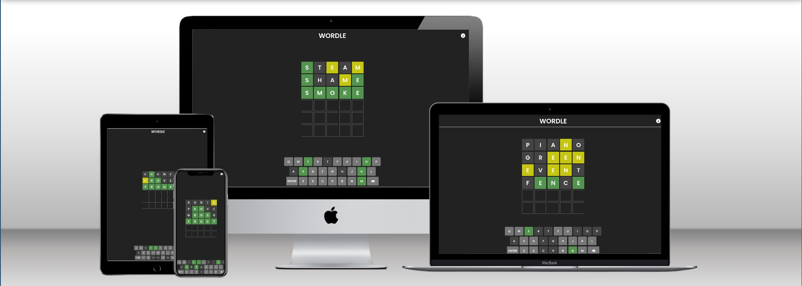
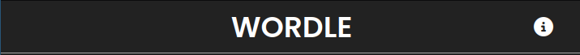
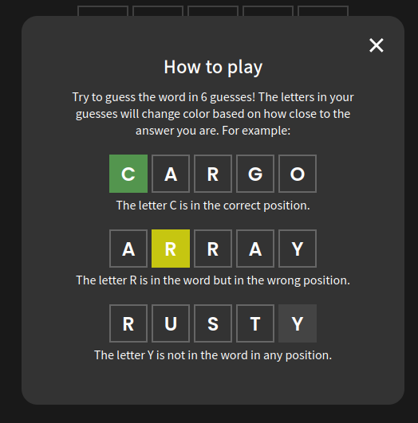
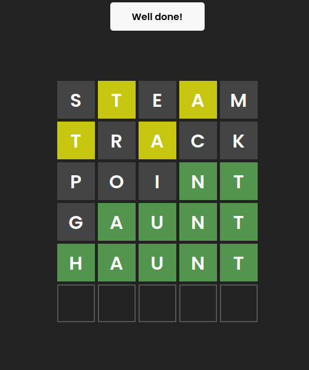
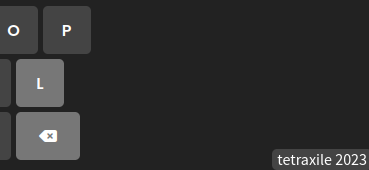
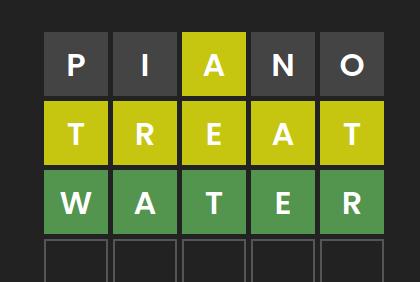

# Wordle

This website is a remake of the puzzle game Wordle.
The site is targeted towards those who are interested in puzzle games, and who would like to test their word memory.

## Features

- __Header__
    - The responsive header sticks to the top of the webpage, and it contains the site logo, along with a navigation menu.
    - The navigation menu has an info button, which the user can select to open a small window that teaches them how to play the game. 

- __Info window__
    - The information window pops up when the user clicks the info button in the navigation menu. This window contains information on how the game works, so the user knows how to play. It's a modal window, meaning the user must exit the window to return to the main page.
    - This window has three examples of guesses in the game, demonstrating what each different color means. These guesses have the exact same style as the game itself, so the user can easily use them to figure out how the game works.]

- __Game__
    - The game itself appears right in the middle of the page. It consists of 6 rows, one for each guess, each containing 5 cells. The user can input using their keyboard to type a guess, and the letters will appear in the first available row. They may also use the on-screen keyboard to enter a guess.
    - When the page is first loaded, a random answer is generated, and it's the user's goal to guess this word in as few guesses as they can.
    - Once the user has made a guess, each letter of that guess will receive a new background color, indicating information about that letter in relation to the answer. This allows the user to work towards getting the answer while still providing quite a challenge.

- __Keyboard__
    - Although the user may input a guess using their own keyboard if they're playing on a computer, the page also includes an on-screen keyboard. This may be used to input guesses, especially on a mobile device.
    - This keyboard serves another purpose, which is to give the user more information when guessing. Once they've made a guess, the letters on this keyboard will light up in addition to the letters in the game area, corresponding again to how close they are to the answer.
    - This helps the user to not use letters they already know aren't in the answer.

- __Footer__
    - The footer contains information about who coded the website and when. It sticks to the bottom right corner of the screen. If the user has a sufficiently thin screen, the footer will disappear so as not to cover the keyboard.

### Features left to implement

- Allow the user to play multiple times, keeping track of their score
- Make the random answer specific to the current day, so everyone can play the same puzzle
- Add more animations to the page, like when revealing the color of the letters, or when opening modal windows
- Settings window, containing options to turn on playing multiple times, adding a hard mode, or a colorblind color scheme

## Testing/Development

At first when making the navigation menu I made the info button as an `<li>` element, but I found that making it a `<button>` element instead would improve accessibility, by allowing the user to select it using the tab key.

When making the onscreen keyboard, I was originally using each key's `innerHTML` property to determine what to do if that key was pressed. However, this didn't work for the backspace key, as it contains a FontAwesome icon rather than any text. Lately, while watching videos about web design, I learned about [data attributes](https://developer.mozilla.org/en-US/docs/Learn/HTML/Howto/Use_data_attributes), and these fit my use case quite a bit better.

My first implementation of the algorithm to determine the color of each letter was incorrect. If the answer was "TREAD" and the user were to guess "TREAT", the second "T" would turn yellow, when it should actually be gray. I sketched on some paper to figure out a way to solve this problem, and then with the help of a [StackOverflow post](https://stackoverflow.com/a/20817684/12317855), I was able to fix it.

I originally made the game board using a `<table>` element, but it behaved oddly when resizing the window. I found that changing from this to instead using a flexbox container improved responsiveness. I continued to use flexbox, as well as grid where necessary, throughout the project to improve the responsiveness as much as I could.

I ran into problems when I wanted the game to take up the rest of the screen space below the header. I tried experimenting with different flexbox style rules, but after trying for a while I found [this post](https://stackoverflow.com/a/24979148/12317855) which solved my problem.

I only started using [Conventional Commit Messages](https://gist.github.com/qoomon/5dfcdf8eec66a051ecd85625518cfd13) midway through the project. I tried to rename an older commit to follow this style, but it changed the timestamp of all commits up to that point, so I left the older commits alone.

### Validator testing

- HTML
    - No errors were returned when passing through the official [W3C validator]
- CSS
    - No errors were returned when passing through the official [(Jigsaw) validator]
- JavaScript
    - One warning was returned when passing through [JSHint]. This warning is mentioned below.

### Unfixed bugs

- When passing through JSHint, my JavaScript code produced one warning, reading as follows: `Functions declared within loops referencing an outer scoped variable may lead to confusing semantics.` I was unable to figure out how to remove this warning, but it doesn't cause any notable issues when running the code.
- When the page is shorter than about 650 pixels, the keyboard starts to get cut off the screen. This could be improved by taking more care about responsiveness.

## Deployment

- The site was deployed to GitHub Pages. The steps to deploy are as follows:
    - In the GitHub repository, navigate to the Settings tab
    - In the Pages section, select the `main` branch and click "Save"
    - Once this branch has been selected, the site will be deployed within a few minutes.

