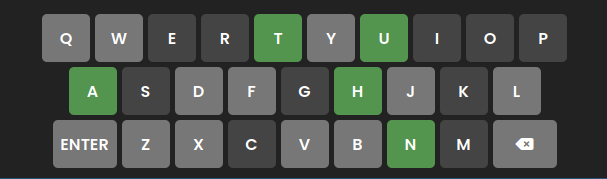

# Wordle

This website is a remake of the puzzle game Wordle.
The site is targeted towards those who are interested in puzzle games, and who would like to test their word memory.

## Features

- __Header__
    - The responsive header sticks to the top of the webpage, and it contains the site logo, along with a navigation menu.
    - The navigation menu has an info button, which the user can select to open a small window that teaches them how to play the game. 

- __Info window__
    - The information window pops up when the user clicks the info button in the navigation menu. This window contains information on how the game works, so the user knows how to play. It's a modal window, meaning the user must exit the window to return to the main page.
    - This window has three examples of guesses in the game, demonstrating what each different color means. These guesses have the exact same style as the game itself, so the user can easily use them to figure out how the game works.]

- __Game__
    - The game itself appears right in the middle of the page. It consists of 6 rows, one for each guess, each containing 5 cells. The user can input using their keyboard to type a guess, and the letters will appear in the first available row. They may also use the on-screen keyboard to enter a guess.
    - When the page is first loaded, a random answer is generated, and it's the user's goal to guess this word in as few guesses as they can.
    - Once the user has made a guess, each letter of that guess will receive a new background color, indicating information about that letter in relation to the answer. This allows the user to work towards getting the answer while still providing quite a challenge.

- __Keyboard__
    - Although the user may input a guess using their own keyboard if they're playing on a computer, the page also includes an on-screen keyboard. This may be used to input guesses, especially on a mobile device.
    - This keyboard serves another purpose, which is to give the user more information when guessing. Once they've made a guess, the letters on this keyboard will light up in addition to the letters in the game area, corresponding again to how close they are to the answer.
    - This helps the user to not use letters they already know aren't in the answer.

- __Footer__
    - The footer contains information about who coded the website and when. It sticks to the bottom right corner of the screen. If the user has a sufficiently thin screen, the footer will disappear so as not to cover the keyboard.

